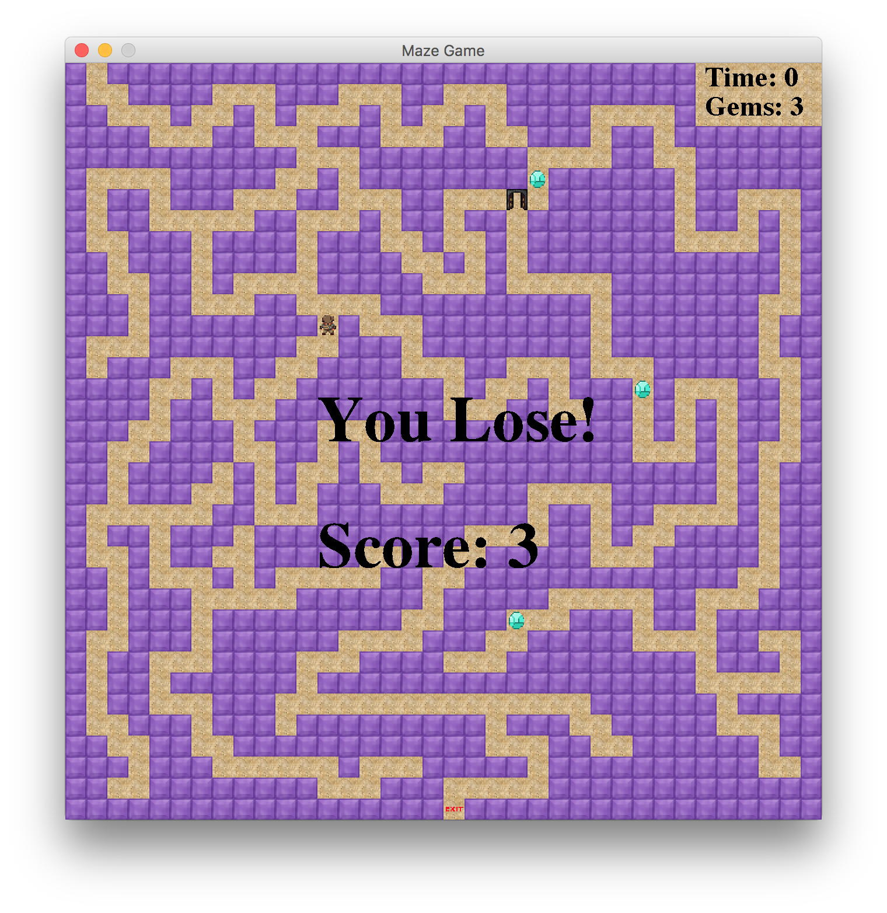

# MazeGame
A simple Maze game created using Java, Swing and awt

## Installation 
```
javac *.java
java MazeGame
```

## Goal
Navigate to the end of the Maze before the time runs out collecting as many gems as you can

## Controls
- Use the arrows to navigate through the maze
- Press 'T' to change the wall's color

## Screenshots



